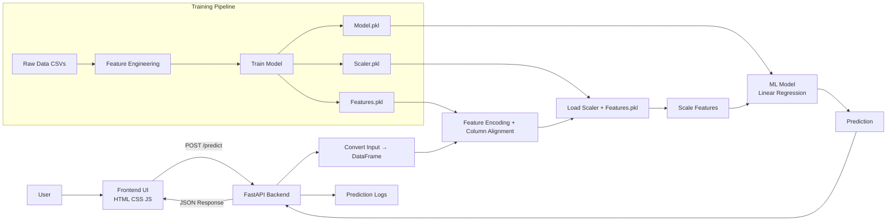

🏏 IPL Player Price Prediction System

📌 Overview

This project predicts the auction price of IPL players based on performance and contextual features using a machine learning pipeline.

It is a complete end-to-end ML system, including:

- Data processing & feature engineering
- Model training pipeline
- REST API using FastAPI
- Interactive frontend UI
- Deployment-ready architecture

---

🌐 Live Demo

 https://s-joshi264.github.io/ipl_frontend/
  

---

⚙️ Tech Stack

- Backend: FastAPI
- Frontend: HTML, CSS, JavaScript
- ML: Scikit-learn (Linear Regression)
- Data Processing: Pandas, NumPy
- Deployment: Render
- Visualization: Mermaid

---

🧠 Problem Statement

IPL player prices depend on multiple factors such as performance, consistency, and role.

This project aims to:

«Predict player auction price using structured performance data.»

---

📊 Features Used

- Strike Rate
- Boundary Percentage
- Dot Ball Percentage
- Total Runs
- Player of Match Count (POM)
- Capped International Status
- Playing Role (One-Hot Encoded)
- Base Price

---

🔄 System Architecture

---

🚀 How It Works

🔹 Training Pipeline

1. Load IPL datasets
2. Perform feature engineering
3. Encode categorical variables
4. Train Linear Regression model
5. Save artifacts:
   - "model.pkl"
   - "scaler.pkl"
   - "features.pkl"

---

🔹 Inference Pipeline

1. User enters player features via UI
2. Data sent to FastAPI backend
3. Backend:
   - converts to DataFrame
   - applies encoding
   - aligns columns using "features.pkl"
   - scales using "scaler.pkl"
4. Model predicts auction price
5. Result returned to frontend

---

📈 Model Performance

- R² Score: (add your value)
- RMSE: (add your value)

---

📝 Logging System

Each prediction is logged with:

- Timestamp
- Input features
- Predicted value
- Session ID

---

⚠️ Limitations

- Does not capture hidden factors (popularity, demand, branding)
- Linear Regression limits complex relationships
- Dataset size and quality affect accuracy

---

🔮 Future Improvements

- Use advanced models (Random Forest, XGBoost)
- Add temporal/consistency features
- Dockerize the application
- Add CI/CD pipeline
- Deploy scalable backend

---

🛠️ Setup Instructions

1. Clone Repository

git clone <your-repo-link>
cd <repo-name>

2. Install Dependencies

pip install -r requirements.txt

3. Run Backend

uvicorn main:app --reload

4. Open Frontend

Open "index.html" or deployed GitHub Pages link.

---

👨‍💻 Author

Subham Joshi,
Aspiring Data Scientist | ML Engineer

---

⭐ If you like this project, give it a star!
